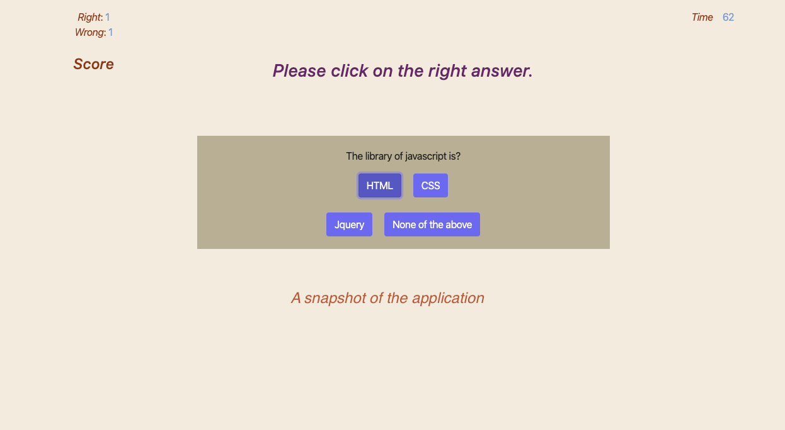

# homework_4-Javascript_quiz
CREATING A JAVASCRIPT QUIZ
                    
                    I developed an application which demonstrates how a quiz can be presented and what criteria can be used.

# Requirement:
1) Counter should add to the correct or wrong answer.
2) On each wrong answer, the timer should sustract 10 sec.

# Functionalities:

A total of 4 questions are asked and each counts to a score of one.
A set of functionalities is added to the application. Once clicked on the start button, a dynemic display with timer shows up.
Every wrong answer will generate one count to wrong counter and every correct answer will add one to correct answer field.
If a question is answered wrong, 10 seconds wll be duducted from the remaining time available to finish the quiz.
Only one HTML file is used with blank elements and a dynamic approach is used to generate the display. 

# Display Demo:

# Deployed application link :
               
               
*https://hmsalmans.github.io/Javascript_quiz/

